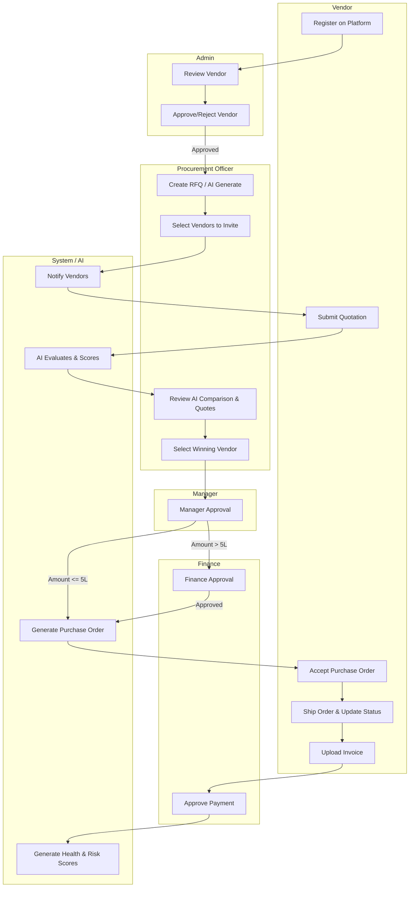
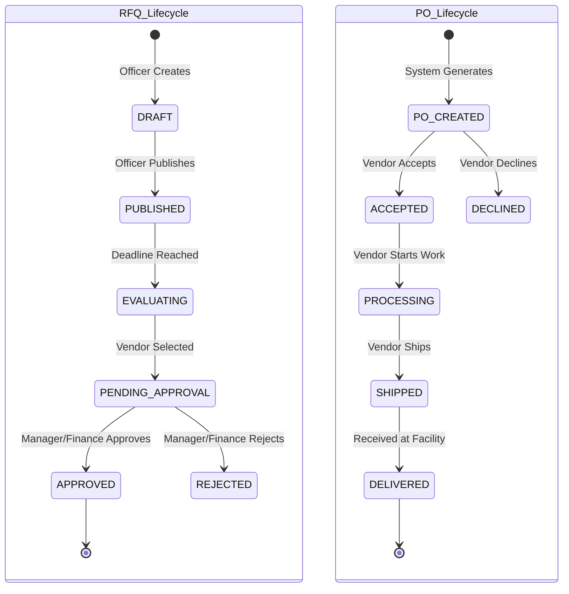
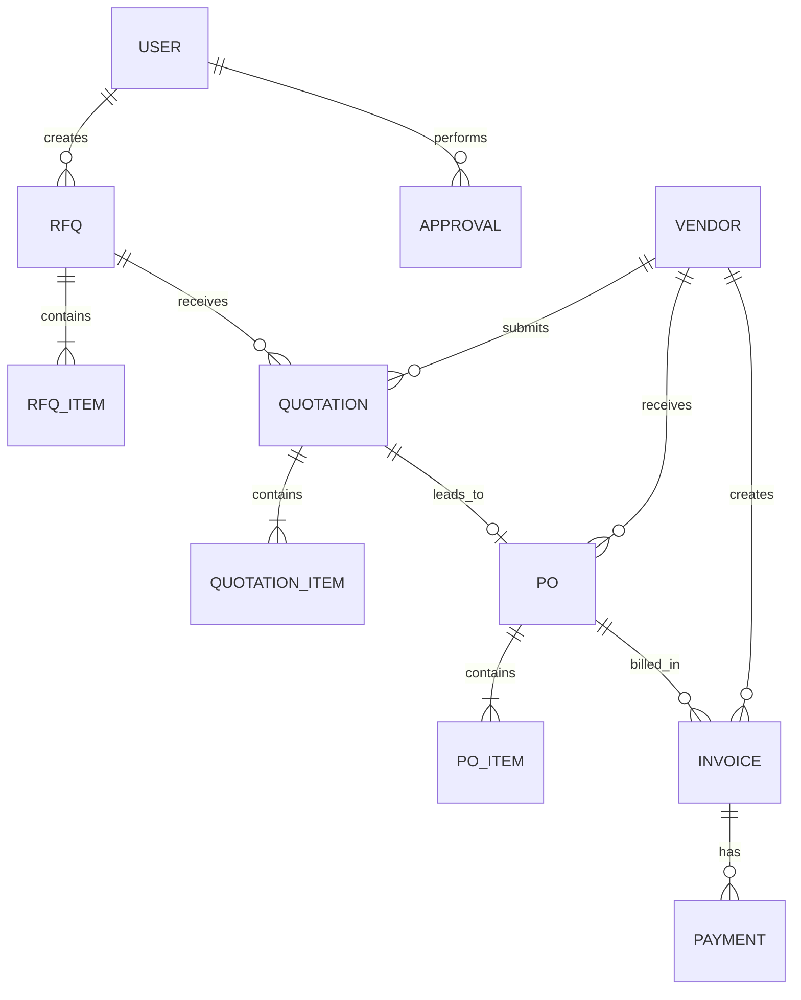
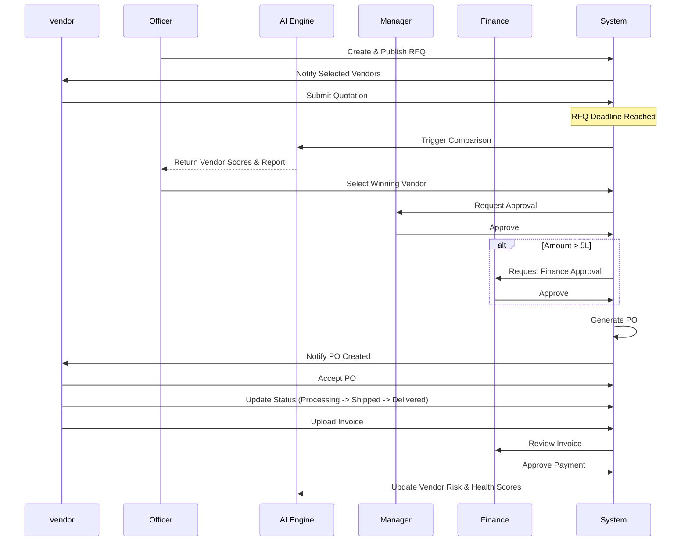

# VendorBridge AI - Procurement Workflow Architecture

This document outlines the enterprise-grade architecture for the VendorBridge AI Procurement Operating System, covering the complete lifecycle from Vendor Onboarding to Invoice Payment.

## 1. BPMN Workflow Diagram



## 2. Workflow State Machine



## 3. Database Relationships



## 4. Status Enums

```typescript
enum VendorStatus {
  PENDING_VERIFICATION,
  VERIFIED,
  REJECTED,
  SUSPENDED
}

enum RFQStatus {
  DRAFT,
  PUBLISHED,
  EVALUATING,
  PENDING_APPROVAL,
  APPROVED,
  REJECTED,
  COMPLETED,
  CANCELLED
}

enum QuotationStatus {
  DRAFT,
  SUBMITTED,
  SELECTED,
  REJECTED
}

enum POStatus {
  PO_CREATED,
  ACCEPTED,
  DECLINED,
  PROCESSING,
  SHIPPED,
  DELIVERED,
  CANCELLED
}

enum InvoiceStatus {
  SUBMITTED,
  PENDING_PAYMENT,
  PAID,
  REJECTED
}
```

## 5. Approval Rules

*   **Level 1: Manager Approval**
    *   **Condition**: Required for all RFQ selections.
    *   **Actions**: `APPROVE`, `REJECT`, `REQUEST_CHANGES`.
*   **Level 2: Finance Approval**
    *   **Condition**: Required if Total PO Amount > ₹5,00,000.
    *   **Actions**: `APPROVE`, `REJECT`.
    *   **Routing**: Initiated automatically upon Manager approval if threshold met.

## 6. Notification Events

1.  `VENDOR_VERIFIED` / `VENDOR_REJECTED`
2.  `RFQ_PUBLISHED`
3.  `QUOTATION_SUBMITTED`
4.  `APPROVAL_REQUESTED` (Manager/Finance)
5.  `APPROVAL_GRANTED` / `APPROVAL_REJECTED`
6.  `PO_GENERATED`
7.  `PO_ACCEPTED` / `PO_DECLINED`
8.  `ORDER_STATUS_CHANGED` (Shipped, Delivered)
9.  `INVOICE_SUBMITTED`
10. `PAYMENT_PROCESSED`

## 7. Socket Events

*   `subscribe:rfq_{id}` -> Listeners for live quotation submissions.
*   `emit:quotation_received` -> Triggers UI update for Procurement Officer.
*   `emit:po_status_update` -> Realtime order tracking update.
*   `subscribe:user_{id}_notifications` -> Realtime notification bell increments.

## 8. Backend Services

We adopt a Domain-Driven Design (DDD) approach:
*   **AuthService**: JWT, RBAC (Role-Based Access Control).
*   **VendorService**: Onboarding, KYC validation, Vendor Profiles.
*   **RFQService**: RFQ CRUD, AI Generation via LLM wrapper, Vendor matching.
*   **QuotationService**: Quotation intake, lock mechanisms after deadline.
*   **AIAnalyticsService**: Vendor Scoring, Risk Analysis, Comparison Reports.
*   **ApprovalEngine**: Workflow state progression, multi-tier routing.
*   **POService**: PO Generation, Status Tracking.
*   **FinanceService**: Invoice processing, Tax calculations, Payment marking.
*   **NotificationService**: Email, Push, WebSocket dispatch.

## 9. Workflow Engine Design

The workflow engine uses a State Machine pattern backed by the database.
*   **Transitions**: Defined via a map of allowed state transitions (e.g., `DRAFT -> PUBLISHED`).
*   **Guards**: Pre-transition hooks that check business rules (e.g., *Is amount > 5L?* *Has deadline passed?*).
*   **Actions**: Post-transition hooks (e.g., *Dispatch Email*, *Generate PO PDF*).

## 10. Prisma Schema Mapping

```prisma
generator client {
  provider = "prisma-client-js"
}

datasource db {
  provider = "postgresql"
  url      = env("DATABASE_URL")
}

model User {
  id        String   @id @default(uuid())
  email     String   @unique
  password  String
  role      Role
  name      String
  vendorId  String?
  vendor    Vendor?  @relation(fields: [vendorId], references: [id])
  rfqs      Rfq[]
}

enum Role {
  ADMIN
  OFFICER
  VENDOR
  MANAGER
  FINANCE
}

model Vendor {
  id             String       @id @default(uuid())
  companyName    String
  gstNumber      String       @unique
  panNumber      String
  status         VendorStatus @default(PENDING_VERIFICATION)
  users          User[]
  quotations     Quotation[]
  purchaseOrders PO[]
}

model Rfq {
  id          String      @id @default(uuid())
  title       String
  budget      Float
  deadline    DateTime
  status      RFQStatus   @default(DRAFT)
  createdById String
  createdBy   User        @relation(fields: [createdById], references: [id])
  quotations  Quotation[]
  po          PO?
}

model Quotation {
  id           String          @id @default(uuid())
  rfqId        String
  vendorId     String
  price        Float
  status       QuotationStatus @default(SUBMITTED)
  rfq          Rfq             @relation(fields: [rfqId], references: [id])
  vendor       Vendor          @relation(fields: [vendorId], references: [id])
  aiScore      Float?
}

model PO {
  id          String    @id @default(uuid())
  rfqId       String    @unique
  vendorId    String
  amount      Float
  status      POStatus  @default(PO_CREATED)
  rfq         Rfq       @relation(fields: [rfqId], references: [id])
  vendor      Vendor    @relation(fields: [vendorId], references: [id])
  invoices    Invoice[]
}

model Invoice {
  id          String        @id @default(uuid())
  poId        String
  amount      Float
  status      InvoiceStatus @default(SUBMITTED)
  po          PO            @relation(fields: [poId], references: [id])
}
```

## 11. API Endpoints

*   **Vendor**:
    *   `POST /api/vendors/onboard`
    *   `PUT /api/vendors/{id}/status` (Admin)
*   **RFQ**:
    *   `POST /api/rfqs` (Officer)
    *   `POST /api/rfqs/ai-generate` (Officer)
    *   `POST /api/rfqs/{id}/publish`
*   **Quotations**:
    *   `POST /api/rfqs/{id}/quotations` (Vendor)
    *   `GET /api/rfqs/{id}/compare` (Triggers AI comparison)
*   **Approvals**:
    *   `POST /api/workflows/rfq/{id}/approve` (Manager/Finance)
*   **Purchase Orders**:
    *   `PUT /api/pos/{id}/status` (Vendor: Accept/Ship)
*   **Invoices**:
    *   `POST /api/pos/{id}/invoices` (Vendor)
    *   `PUT /api/invoices/{id}/pay` (Finance)

## 12. Sequence Diagram



## 13. Event Driven Architecture

Leveraging a Pub/Sub model (e.g., Redis PubSub or Apache Kafka) for decoupling:
*   `vendor.created` -> Admin Service indexing
*   `rfq.published` -> Notification Service
*   `quotation.received` -> AI Analytics Service (real-time scoring update)
*   `rfq.deadline_passed` -> Cron/Scheduler Service triggers comparison workflow
*   `approval.completed` -> Document Generation Service (PO PDF creation)
*   `po.delivered` -> Finance Service (Invoice enablement)

## 14. Enterprise Grade Folder Structure

```text
src/
├── app.ts                 # App entry point
├── config/                # Environment, DB, Logger configs
├── modules/               # Domain-Driven Modules
│   ├── auth/              # JWT, RBAC
│   ├── vendor/            # Profiles, Verification
│   ├── rfq/               # Creation, AI Generation
│   ├── quotation/         # Intake, Evaluation
│   ├── workflow/          # Approval Engine, State Machine
│   ├── po/                # Purchase Orders, Tracking
│   ├── invoice/           # Billing, Finance
│   └── analytics/         # AI Insights, Health Scores
├── shared/
│   ├── services/          # AI Service, Mail Service, S3 Uploads
│   ├── utils/             # Formatters, Constants
│   └── exceptions/        # Global Error Handlers
├── websockets/            # Socket.io handlers
└── prisma/
    ├── schema.prisma      # DB Schema
    └── migrations/
```

## 15. Complete Procurement Lifecycle Flow

1.  **Vendor Discovery & KYC**: Vendors self-register; Admins vet and approve them into the trusted network.
2.  **Sourcing Strategy**: Procurement Officers generate structured RFQs (assisted by AI) and intelligently broadcast them to matching vendors.
3.  **Bidding & Intake**: Vendors submit detailed quotations securely before the system automatically locks the RFQ upon deadline.
4.  **AI Due Diligence**: The AI Engine evaluates proposals against historical data, risk metrics, and price algorithms to rank vendors objectively.
5.  **Multi-Tier Governance**: Decisions route through structural approval matrices (Manager -> Finance) ensuring compliance and budget validation.
6.  **Contract Execution**: System generates legally binding Purchase Orders directly from approved quotes.
7.  **Supply Chain Tracking**: Vendors update logistical milestones via the portal, offering complete visibility.
8.  **Procure-to-Pay**: Delivery triggers automated invoice capability, routed to Finance for final settlement and payment reconciliation.
9.  **Continuous Intelligence**: Post-mortem data feeds back into the AI engine to adjust Vendor Risk Scores and future Procurement Health forecasts.
